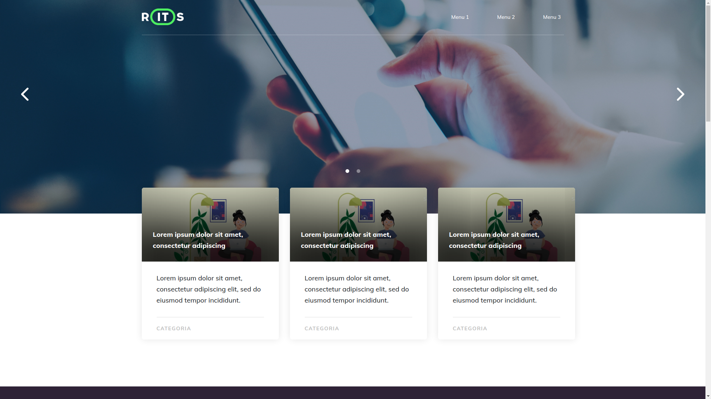

<h1 align="center">Desafio da RITS</h1>

<p align="center">
  
  
  <a href="https://github.com/jeffessongomes">
    
  </a>
  
<p>

<p align="center">
 <a href="#computer-sobre">Sobre</a> •
 <a href="#triangular_ruler-status-do-projeto">Status</a> •
 <a href="#dvd-executar-o-projeto">Executar</a> •
 <a href="#hammer-tecnologias">Tecnologias</a> •
 <a href="#boy-autor">Autor</a> •
 <a href="#page_facing_up-licença">Licença</a>
</p>

## :computer: Sobre

O projeto é um desafio, onde deveria clonar um layout que foi feito no Adobe XD e foi proposto pela [RITS](https://rits.dev)


---

### :camera_flash: Demonstração [LINK](https://rits-challenge.herokuapp.com)

<p align="center">
  
</p>

<p align="center">
	Você pode ver a demonstração nesse site (https://rits-challenge.herokuapp.com)
</p>

---
### :hammer: **Tecnologias**

As seguintes ferramentas foram utilizadas na construção do projeto:

- [React](https://reactjs.org)
- [StyledComponents](https://styled-components.com)

---
### :triangular_ruler: **Status do Projeto**

<h4 align="center"> 
	👨‍🏫 O desafio está finalizado !
</h4>

### :dvd: **Executar o Projeto**

```bash
# Clone este repositório
$ git clone https://github.com/jeffessongomes/verbose-goggles

# Acesse a pasta do projeto no terminal/cmd
$ cd verbose-goggles

# Instale as dependências
$ npm install

# Execute a aplicação em modo de desenvolvimento
$ npm start
```

### :boy: **Autor**

<div align="center">
<a href="https://github.com/jeffessongomes">
 
 <br />
 <sub><b>Jeffesson Gomes</b></sub></a>

Feito com ❤️ por Jeffesson Gomes 👋🏽 Entre em contato!

[](https://www.linkedin.com/in/jeffesson-gomes-de-almeida-2b36911aa/)
[](https://github.com/jeffessongomes)
</div>

---
### :page_facing_up: **Licença**

<br />

Este projeto é licenciado pelo [MIT](./LICENSE).
